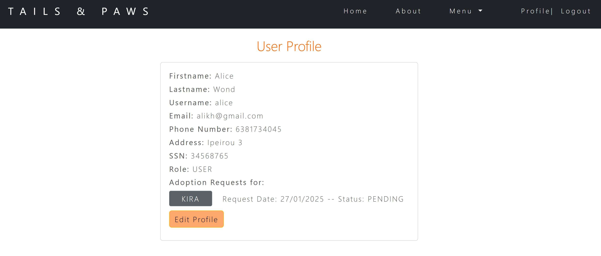
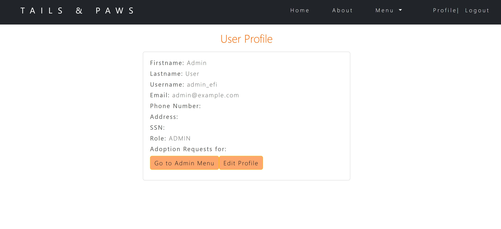
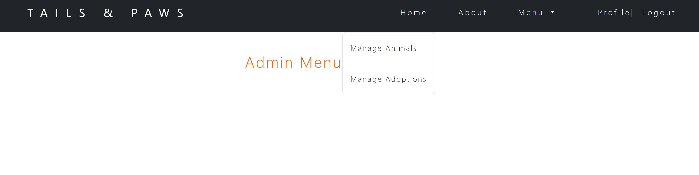

Adoption Animal Platform

This project is a web-based platform for managing animal adoption, developed as the final project for Coding Factory 6.
It is built with Spring Boot for the backend and Angular for the frontend, showcasing a full-stack web application.
The application allows administrators to manage animals and adoption requests, and users to submit requests and adopt animals.

Administrator Features:
Create, update, and delete animals.
Manage adoption requests.

User Features:
Register and log in.
Submit adoption requests for animals available for adoption..
View their adoption requests status.

The backend provides the following key endpoints:

Animal Management From Admin:

POST /login/admin/animals - Create a new animal.

PUT /login/admin/animals/{id} - Update animal details.

DELETE /login/admin/animals/{id} - Delete an animal.

GET /login/admin/adoptions - Retrieve all pending adoption requests.

PATCH /login/admin/adoptions/{id} - Update the status of an adoption request.

Animal info:

GET /animals - Retrieve all animals.

GET /animals/adoption - Retrieve animals available for adoption.

GET /animals/{id} - Retrieve details of a specific animal.

Adoption Requests

POST /adoption-request - Submit an adoption request.

User Management

POST /auth/signup - Register a new user.

POST /auth/login - User login.

GET /login/user-details/{username} - Retrieve user profile.

PUT /login/user-details/{username} - Update user profile.

For detailed request and response examples, refer to the Swagger UI.

Angular Frontend Details

The frontend application provides the following main pages:

Home and About Page:
Displays a welcome message and brief introduction to the platform.

Login and Signup:
Allows users to register or log in to the platform.

Animal List:
Shows all animals and animals available for adoption.

Adoption Requests:
Users can submit their adoption requests, and this page allows them to verify the details of the request before submitting.

User Profile:
The User Profile page displays the user’s personal information and the status of any adoption requests they have submitted.

On this page, users can update their profile information, such as their contact details, password, or preferences.

Admin Dashboard:
Accessible to administrators for managing animals and adoption requests.

The Admin Menu provides options to access different areas such as animal management and adoption requests.

Administrators can manage the list of animals here, including adding, editing, or removing animals from the system.

Review all pending adoption requests.

Administrators can update the status of adoption requests ( Pending, Approved, Rejected).

Administrators can add new animals to the system, providing details such as the animal’s name, species, and availability for adoption.

Administrators can modify the details of an existing animal.

GETTING STARTED

Open your command line (Terminal or Command Prompt) to run the following commands:
Clone the repository:
git clone https://github.com/your-username/animal-adoption-app.git

- Frontend Setup (Angular)
Navigate to the frontend folder:
Install the dependencies:
npm install

Update the base URL:
Open src/app/services/environment.development.ts and update the myBaseUrl string to match your backend URL.

Start the Angular development server:
ng serve

- Backend Setup (Spring Boot)
Open the backend project in your preferred Java IDE (e.g., IntelliJ IDEA or Eclipse).
Configure the database connection in src/main/resources/application-test.properties:

spring.datasource.url=jdbc:mysql://localhost:3306/animal_adoption_db
spring.datasource.username=root
spring.datasource.password=your_password
spring.jpa.hibernate.ddl-auto=update
spring.datasource.driver-class-name=com.mysql.cj.jdbc.Driver
spring.jpa.properties.hibernate.dialect=org.hibernate.dialect.MySQL5InnoDBDialect

Run the Spring Boot application.

- Database Setup (MySQL)
Create the Database:

Run the following SQL command in your MySQL client:
CREATE DATABASE animal_adoption_db;

Ensure MySQL is running.
Update the application.properties file in the backend as mentioned above.

Running the Backend:
The application will automatically create the necessary tables if configured with spring.jpa.hibernate.ddl-auto=update.

Build and Deploy
To build the Angular frontend:
ng build
The build output will be stored in the dist/ folder.
Access the Application
Once the server is running, open the application in your browser:

Frontend: http://localhost:4200
Backend: The backend REST API will run on the default Spring Boot port (http://localhost:8080).
This provides clear and fast instructions for users to set up both the frontend, backend, and database for the application.

