Adoption Animal Platform

This project is a web-based platform for managing animal adoption, built with Spring Boot for the backend and Angular for the frontend. 
The application allows administrators to manage animals and adoption requests, and users to submit requests and adopt animals.

Administrator Features:
Create, update, and delete animals.
Manage adoption requests.

User Features:
Register and log in.
Submit adoption requests for animals available for adoption..
View their adoption requests status.

The backend provides the following key endpoints:

Animal Management From Admin:

POST /login/admin/animals - Create a new animal.

PUT /login/admin/animals/{id} - Update animal details.

DELETE /login/admin/animals/{id} - Delete an animal.

GET /login/admin/adoptions - Retrieve all pending adoption requests.

PATCH /login/admin/adoptions/{id} - Update the status of an adoption request.

Animal info:

GET /animals - Retrieve all animals.

GET /animals/adoption - Retrieve animals available for adoption.

GET /animals/{id} - Retrieve details of a specific animal.

Adoption Requests

POST /adoption-request - Submit an adoption request.

User Management

POST /auth/signup - Register a new user.

POST /auth/login - User login.

GET /login/user-details/{username} - Retrieve user profile.

PUT /login/user-details/{username} - Update user profile.

For detailed request and response examples, refer to the Swagger UI.

Angular Frontend Details

The frontend application provides the following main pages:

Home and About Page:
Displays a welcome message and brief introduction to the platform.
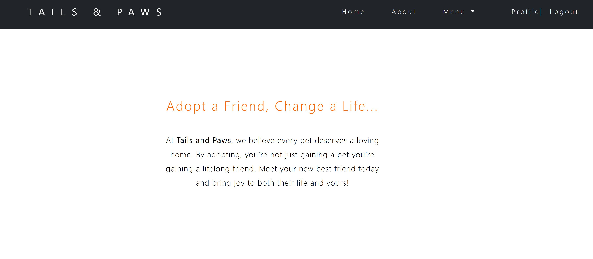
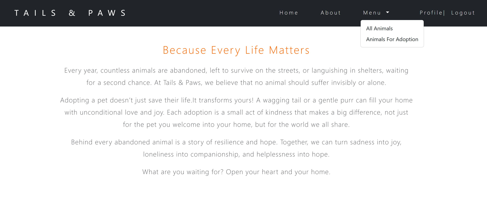

Login and Signup:
Allows users to register or log in to the platform.
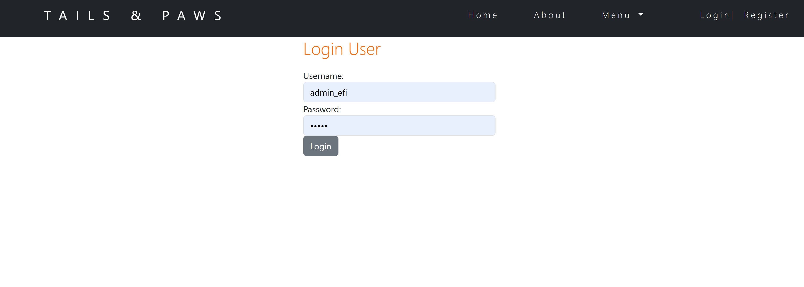
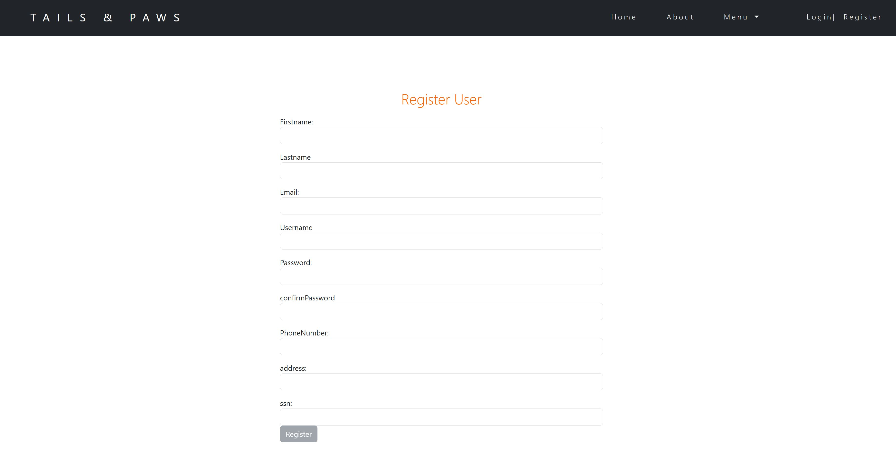

Animal List:
Shows all animals and animals available for adoption.
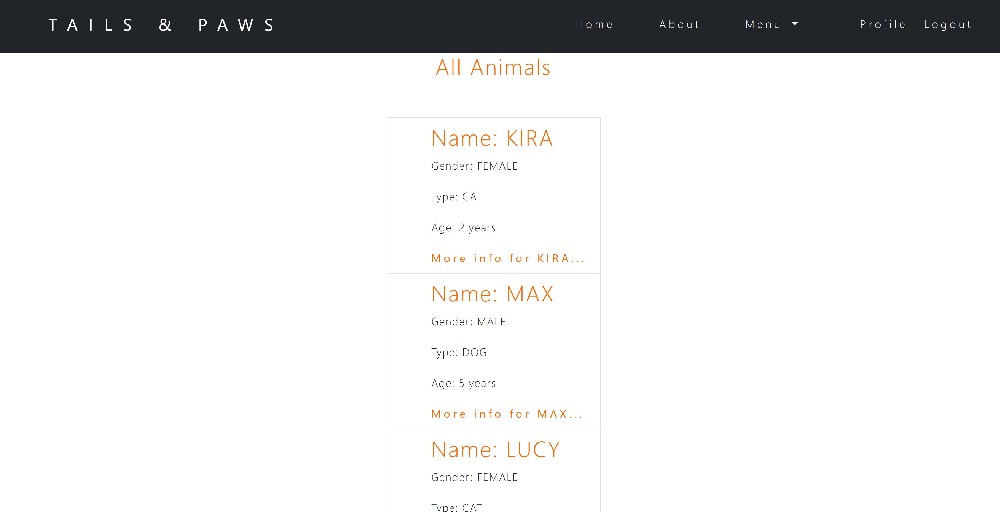
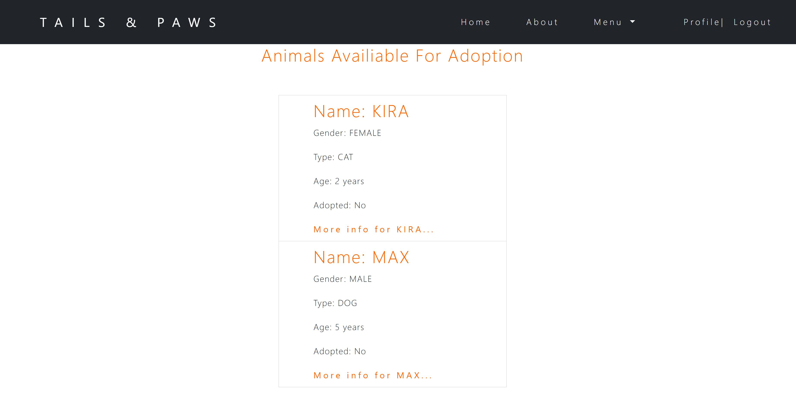
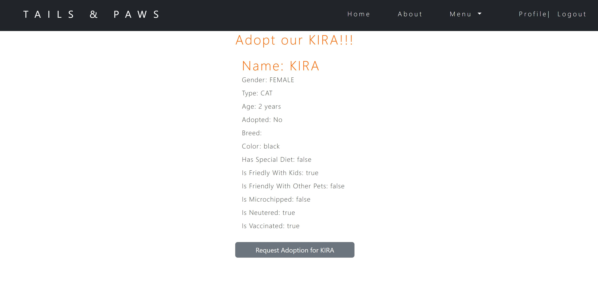

Adoption Requests:
Users can submit requests.
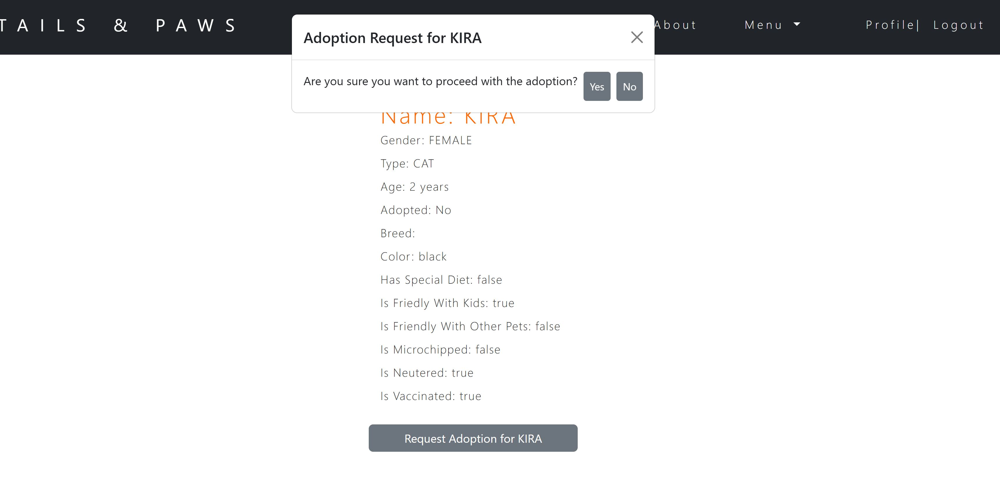
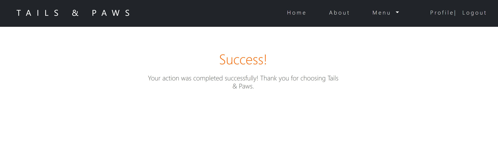

User Profile:
User can view the status of their requests and edit their profile
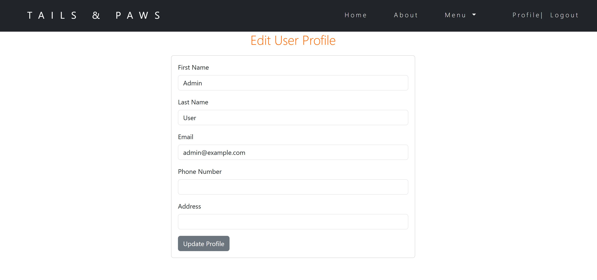

Admin Dashboard:
Accessible to administrators for managing animals and adoption requests.
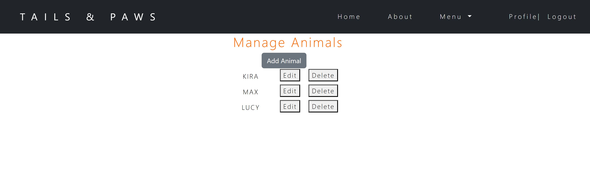
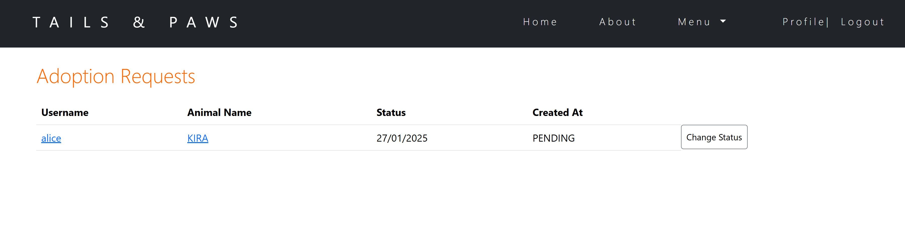
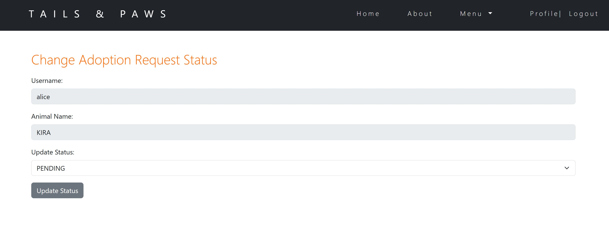
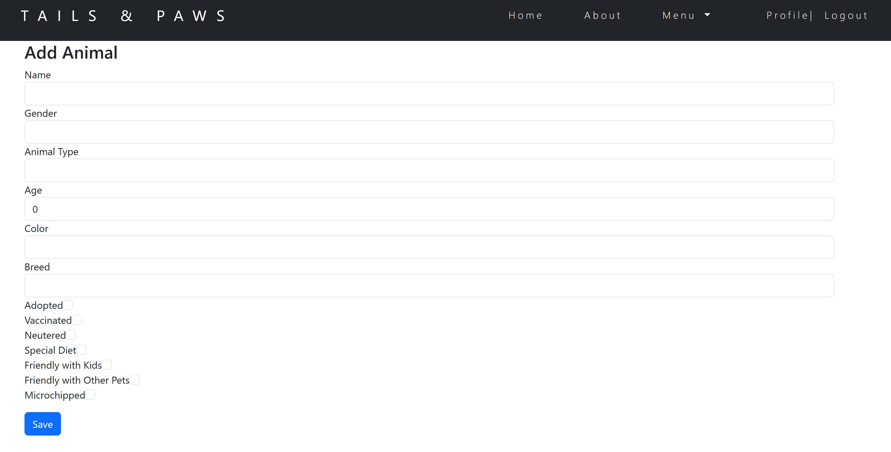
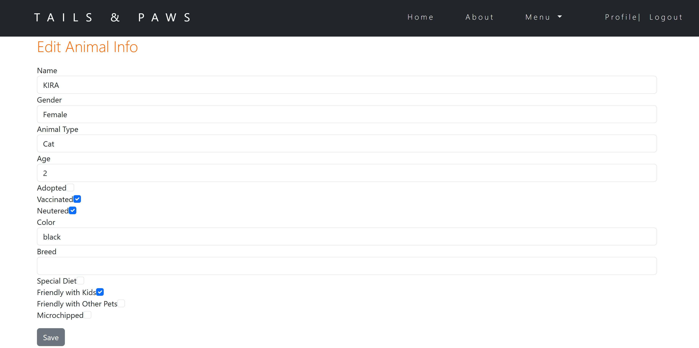

